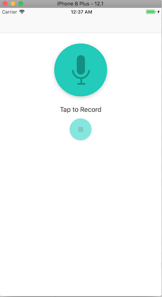
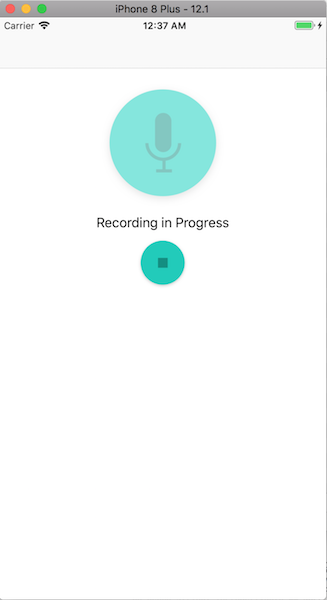
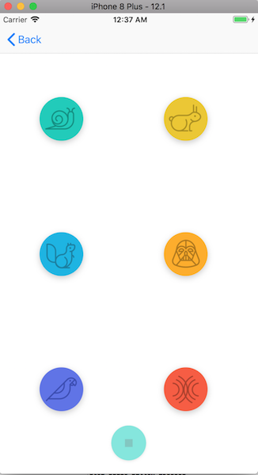

# PITCH-PERFECT

* [PITCH-PERFECT](#pitch-perfect)
  * [Implementation](#implementation)
  * [Requirements](#requirements)
  * [How to Contribute](#how-to-contribute)
  * [License](#license)
  * [Other Resources](#other-resources)

Pitch Perfect is the first project from the **Udacity's iOS Developer Nanodegree course** `(nd003)`.

The app allows users to record a sound using the device's microphone, and then allows users to play the recorded sound with different sound modulations.

Effects are: Slow, Fast, High Pitch, Low Pitch, Echo and Reverb.

## Implementation

The app has two view controller scenes:

- **RecordSoundsViewController** - consists a record button with a microphone image. Tapping this microphone button 
starts an audio recording session and present a stop button. When the stop button is clicked, the app completes recording and then show the PlaySound controller.

- **PlaySoundsViewController** - contains six buttons to play the recorded sound file with different effects and a button to stop the playback.

The application uses code from `AVFoundation` to record sounds from the microphone (`AVAudioRecorder`) and play recorded audio with effects (`AVAudioPlayerNode`, `AVAudioEngine`).

## Requirements

- Xcode 9.2
- Swift 4.0

## How to Contribute

Find any typos? Have another resource you think should be included? Contributions are welcome!

First, fork this repository. I'll be happy to know if this example is useful for you.

Next, clone this repository to your desktop to make changes.

Once you've pushed changes to your local repository, you can create a pull request with your suggestion.

It's good take a look at the [Contributing Guide](CONTRIBUTING.MD)

## License

The contents of this repository are covered under the [MIT License](LICENSE.txt).

## Other Resources

- Assets : The assets package was provided from Udacity Team

<small><i><a href='http://ecotrust-canada.github.io/markdown-toc/'>Table of contents generated with markdown-toc</a></i></small>
